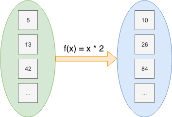
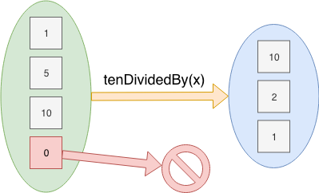
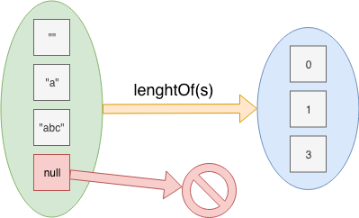
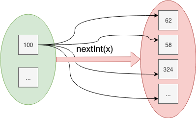
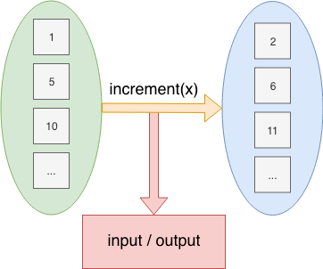

### First class functions

Functions can and should be treated as any other kind of data type

```scala
// method definition
def increment(number: Int): Int = number + 1
increment(10) // res: Int = 11

// anonymous function expression
((number: Int) => number + 1)
((number: Int) => number + 1)(10) // res: Int = 11

// function definition
val increment: Int => Int = (number) => number + 1
increment(10) // res: Int = 11
```

---

### First class functions

We can do with functions everything we can do with other values

```scala
val increment:  Int => Int = number => number + 1
val decrement:  Int => Int = number => number - 1
val duplicate:  Int => Int = number => number * 2

val listOfFunctions: List[Int => Int] = List(
  increment, decrement, duplicate
)

val mapOfFunctions: Map[String, Int => Int] = Map(
  "++" -> increment,
  "--" -> decrement,
  "*2" -> duplicate,
)
```

---

### First class functions

Methods can be converted to functions with the η-expansion (eta-expansion)
mechanism

```scala
def increment(number: Int): Int = number + 1

// error: missing argument list for method increment
val function = increment

// manually eta-expanding a method to a function
val function = (number: Int) => increment(number)

// semi-automatic eta-expansion of a method to a function *
val function = increment _
```

<small>* One of the many `_` (underscore) operator semantics in Scala</small>

---

### Higher order functions

Because functions are values, they can be passed as arguments to other
functions or methods

```scala
def ifNonBlank(s: String, f: String => String):  String =
  if (s.isBlank) s else f(s)

val spacesToDots: String => String = s => s.replaceAll(" ", ".")

ifNonBlank("lorem ipsum", spacesToDots) // res = "lorem.ipsum"
ifNonBlank("   "        , spacesToDots) // res = "   "
```

---

### Higher order functions

Also becasue functions are values, they can be returned from other functions or
methods

```scala
def incrementBy(n: Int): Int => Int = number => number + n

val incrementByOne:  Int => Int = incrementBy(1)
val incrementByFive: Int => Int = incrementBy(5)

incrementByOne(5)  // 6
incrementByFive(5) // 10

incrementBy(3)(4) // 7
```

---

### Curried functions

Multi-argument functions can be encoded as a chain of single-argument
functions. This is called Currying*

```scala
def add(x: Int, y: Int): Int = x + y
add(5, 2) // 7
```

```scala
def add(x: Int): Int => Int = y => x + y
add(5)(2) // 7
```

<small>* In honor of Haskell Curry, who discovered this encoding</small>

---

### Curried functions

Multi-argument functions can be encoded as a chain of single-argument
functions. This is called Currying

```scala
val add: (Int, Int) => Int = (x, y) => x + y
add(5, 2) // 7
```

```scala
val add: Int => Int => Int = x => y => x + y
add(5)(2) // 7
```

<small>* In honor of Haskell Curry, who discovered this encoding</small>

---

### Curried functions

Scala has a syntax for multiple lists of arguments, providing a currying
look-alike behaviour for methods

```scala
def add(x: Int): Int => Int = y => x + y
add(5)(2) // 7
```

```scala
def add(x: Int)(y: Int): Int = x + y
add(5)(2) // 7
```

---

### Curried functions

Curried functions and multiple lists of arguments are widely used in Scala as
syntactic sugar for giving a function the appearance of a native DSL

```scala
def ifNonBlank(s: String)(f: String => String):  String =
  if (s.isBlank) s else f(s)

ifNonBlank("lorem ipsum")(s => s.replaceAll(" ", "."))

// curly braces syntax makes it look like a native construct
ifNonBlank("lorem ipsum") {
  s => s.replaceAll(" ", ".")
}
```

---

### Partial application

Curried functions enable creation of new functions by partial application of
their arguments

```scala
val add: Int => Int => Int = x => y => x + y

val add3: Int => Int = add(3)
val add5: Int => Int = add(5)

add3(5) // 8
add5(5) // 11
```

---

### Partial application

η-expansion can also be used to partially-apply a `n` arity method into a `n-1`
arity function

```scala
def add(x: Int, y: Int): Int = x + y

val add3: Int => Int = add(3, _)
val add5: Int => Int = add(5, _)

add3(1) // 4
add5(1) // 6
```

---

### Function composition

Two functions `f` and `g` can be composed whenever the output type of `f` is
the same as the input type of `g`

The composition result will be a function from the input of `f` to the output
of `g`

```scala
val f: Int    => String
val g: String => Double

// composed function
val h: Int => Double = x => g(f(x))
```

---

### Function composition

Pseudo-automatic function composition can be done in Scala by using `compose`
or `andThen`, defined in all function types

```scala
val f: Int    => String
val g: String => Double

// manually composed function
val h: Int => Double = x => g(f(x))

// compose: first the outermost then the innermost
val h: Int => Double = g compose f

// andThen: first the innermost then the outemost
val h: Int => Double = f andThen g
```

---

### Function execution models

Arguments are, by default in most programming languages, evaluated before the
function is evaluated. This is more formally called **call-by-value**

```scala
def f(argument: Int): Int = argument + 1

// Transformations applied
f(3 + 5) --> f(8) --> { 8 + 1 }
```

---

### Function execution models

Scala also supports* **call-by-name**, which makes the argument not being
evaluated up until the point of usage

```scala
def f(argument: => Int): Int = argument + 1

// Transformations applied
f(3 + 5) --> { (3 + 5) + 1 }
```

<small>* Only available in method declarations, not in function literals</small>

---

### Function execution models

The big advantage of by-name arguments are that they don't get evaluated if
they are not used inside the method

```scala
def f(argument: Int): Int = 42
f(3 + 5) --> f(8) --> { 42 }

def g(argument: => Int): Int = 42
g(3 + 5) --> { 42 }
```

---

### Function execution models

Call by need can be *emulated* by passing a 0-arity method as argument

The following method signatures are syntactically different but semantically
equivalent

```scala
def f(argument: => Int): Int = argument + 1
f(3 + 5)

def g(argument: () => Int): Int = argument() + 1
f(() => 3 + 5)
```

---

### Function execution models

By-name arguments, unlike their by-value counterparts, are re-evaluated each
time they are used in the method body

```scala
def f(argument: => Int): Int = argument + argument + 1

// Transformations
f(3 + 5) --> { (3 + 5) + (3 + 5) + 1 }
```

---

### Function execution models

A mechanism, not available natively in Scala, called **call-by-need** would
prevent that behaviour, making the argument be evaluated only once upon the
first usage, so hypothetically it would look like:

```scala
def f(argument: => Int): Int = argument + argument + 1

// Transformations
f(3 + 5) --> { (3 + 5) + argument + 1 }
         --> { 8 + argument + 1 }
         --> { 8 + 8 + 1 }
```

---

### Function execution models

Nevertheless, this **call-by-need** semantic can be *emulated* in Scala by
assigning the argument to a `lazy` variable inside the method body

```scala
def f(argument: => Int): Int = {
  lazy val byNeedArgument = argument
  byNeedArgument + byNeedArgument + 1
}

// Transformations
f(3 + 5) --> { byNeedArgument + byNeedArgument + 1 }
         --> { (3 + 5)  + byNeedArgument + 1 }
         --> { 8 + byNeedArgument + 1 }
         --> { 8 + 8 + 1 }
```

---

### Pure functions

Pure functions are functions which hold three specific properties:

* **Total**: they always return a value for every possible input

* **Deterministic**: they always return the same value for the same input

* **Inculpable**: they have no (direct) interaction with the world or program state

---

### Pure functions

Pure functions, as mathematical functions, are just a transformation from an
input to an output



---

### Pure functions

* Programming functions are not pure functions in the general sense

* Some restrictions can be applied to treat all programming functions as pure

* This methodology helps to reason about what a piece of can and cannot do

---

### Impure functions

Partial functions: not all the inputs produce an output

```scala
def tenDividedBy(x: Int): Int = 10 / x

tenDividedBy(1)  // res: Int = 10
tenDividedBy(5)  // res: Int = 5
tenDividedBy(10) // res: Int = 2

tenDividedBy(0)  // java.lang.ArithmeticException: / by zero
```

---

### Impure functions

Partial functions: not all the inputs produce an output



---

### Impure functions

`Null` is a non-escapable case of partiality in Scala

```scala
def lengthOf(s: String): Int = s.length

lenghtOf("")    // res: Int = 0
lengthOf("a")   // res: Int = 1
lengthOf("abc") // res: Int = 3

lengthOf(null) // java.lang.NullPointerException
```

---

### Impure functions

`Null` is a non-escapable case of partiality in Scala



---

### Impure functions

Nondeterministic functions: the same input does not always produce the same
output

```scala
def nextInt(max: Int): Int =
  scala.util.Random.nextInt(max)

nextInt(100) // res: Int = 62
nextInt(100) // res: Int = 38
```

```scala
def secondsAfterNow(seconds: Int): java.time.Instant =
  java.time.Instant.now().plusSeconds(seconds)

secondsAfterNow(1) // res: Instant = 2019-08-26T12:15:42.496Z
secondsAfterNow(1) // res: Instant = 2019-08-26T12:15:42.501Z
```

---

### Impure functions

Nondeterministic functions: the same input does not always produce the same
output



---

### Impure functions

Effectful functions: not only a transformation from input to output, they
perform som extra side effect

```scala
def increment(num: Int): Int = {
  println(s"Incrementing ${num} to ${num + 1}")
  num + 1
}

increment(1)
// Incrementing 1 to 2
// res: Int = 2

increment(5)
// Incrementing 5 to 6
// res: Int = 6
```

---

### Impure functions

Effectful functions: not only a transformation from input to output, they
perform som extra side effect

```scala
var totalIncrementCalls: Int = 0

def increment(num: Int): Int = {
  totalIncrementCalls = totalIncrementCalls + 1
  num + 1
}

totalIncrementCalls // res: Int = 0

increment(1) // res: Int = 2
increment(5) // res: Int = 6

totalIncrementCalls // res: Int = 2
```

### Impure functions

Effectful functions: not only a transformation from input to output, they
perform som extra side effect



---

### Pure functions

Requisites to treat a programming function as pure:

* Deterministic
* Does not throw exceptions
* Does not return `null`
* Does not perform side effects
* Does not incurr in observable mutability

---

### Referential transparency

An expression is *referentially transparent* if it can be replaced with its
corresponding result value without changing the program's behaviour

Pure functions are referentially transparent, allowing for a great deal of code
reuse, performance optimisation, understanding and control of a program

Impure functions are not referentially transparent. They cannot be replaced
with a value

---

### Referential transparency

Referential transparency enables *equational reasoning*. This kind of reasoning
is the one used in high-school equations, based in the simple substitution
model of variables and values.

```scala
val x = increment(1)
val y = increment(2)

val z = x + y
```

---

### Referential transparency

Referential transparency enables *equational reasoning*. This kind of reasoning
is the one used in high-school equations, based in the simple substitution
model of variables and values.

```scala
val x = 2
val y = 3

val z = x + y
```

---

### Referential transparency

Referential transparency enables *equational reasoning*. This kind of reasoning
is the one used in high-school equations, based in the simple substitution
model of variables and values.

```scala
val z = 2 + 3
```

---

### Referential transparency

Referential transparency enables *equational reasoning*. This kind of reasoning
is the one used in high-school equations, based in the simple substitution
model of variables and values.

```scala
val z = 5
```

---

### Referential transparency

Refactoring: remove unused code

```scala
// Pure functions
val fooToBaz: Foo => Baz
val barToBaz: Bar => Baz
val bazToBaz: Baz => Baz
```

```scala
def helloWorld(foo: Foo, bar: Bar): Baz = {
  val baz1 = fooToBaz(foo)
  val baz2 = barToBaz(bar)

  bazToBaz(baz1)

  baz2
}
```

---

### Referential transparency

Refactoring: remove unused code

```scala
// Pure functions
val fooToBaz: Foo => Baz
val barToBaz: Bar => Baz
val bazToBaz: Baz => Baz
```

```scala
def helloWorld(foo: Foo, bar: Bar): Baz = {
  // UNUSED: val baz1 = fooToBaz(foo)
  val baz2 = barToBaz(bar)

  // UNUSED: bazToBaz(baz1)

  baz2
}

```

---

### Referential transparency

Refactoring: remove unused code

```scala
// Pure functions
val fooToBaz: Foo => Baz
val barToBaz: Bar => Baz
val bazToBaz: Baz => Baz
```

```scala
def helloWorld(foo: Foo, bar: Bar): Baz = barToBaz(bar)
```

---

### Referential transparency

Refactoring: de-duplicate

```scala
// Pure functions
val f: Int => Int
val g: (Int, Int) => Int
```

```scala
def doSomething(n: Int): Int => {
  val x = f(n)
  val y = f(n)
  g(x, y)
}
```

---

### Referential transparency

Refactoring: de-duplicate

```scala
// Pure functions
val f: Int => Int
val g: (Int, Int) => Int
```

```scala
def doSomething(n: Int): Int = {
  val x = f(n)
  g(x, x)
}
```

---

### Referential transparency

Easier testing

How could we test this?

```scala
def greetings(name: String): String = {
  val currentTime = java.time.LocalDateTime.now()
  val currentHour = currentTime.getHour

  if (currentHour < 4  && currentHour < 13)
    s"Good morning, ${name}"
  else if (currentHour > 12 && currentHour < 17)
    s"Good afternoon, ${name}"
  else if (currentHour > 16 && currentHour < 20)
    s"Good evening, ${name}"
  else
    s"Good night, ${name}"
}
```

---

### Referential transparency

Easier testing

If the function was pure, concerned only with its domain logic, it would become
very easy to test

```scala
def greetings(currentHour: Int, name: String): String =
  if (currentHour < 4  && currentHour < 13)
    s"Good morning, ${name}"
  else if (currentHour > 12 && currentHour < 17)
    s"Good afternoon, ${name}"
  else if (currentHour > 16 && currentHour < 20)
    s"Good evening, ${name}"
  else
    s"Good night, ${name}"
```

---

### Referential transparency

Easier testing

If the function was pure, concerned only with its domain logic, it would become
very easy to test

```scala
assert(greetings(7 , "Alonzo") == "Good morning, Alonzo")
assert(greetings(14, "Alonzo") == "Good afternoon, Alonzo")
assert(greetings(19, "Alonzo") == "Good evening, Alonzo")
assert(greetings(23, "Alonzo") == "Good night, Alonzo")
```

---

### Functional Programming

Functional programming is the act of writing programs only with pure functions.

But if every function needs to be pure, how does anything useful get done?
